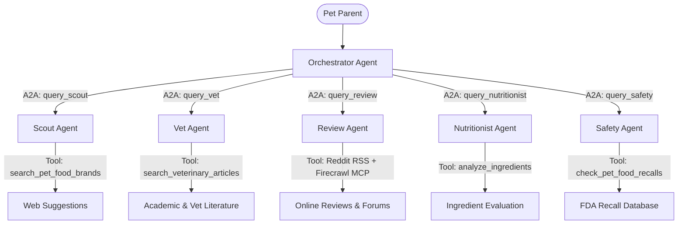

# BiteWise: A Multi-Agent System for Trustworthy Pet Food Recommendations

Five specialist AI agents — Scout, Vet, Review, Nutritionist, and Safety — working together to turn "what should I feed my pet?" from hours of scattered research into one grounded, synthesized answer.

**Track:** Concierge Agents

## Concepts Demonstrated

BiteWise was built to demonstrate the core required concepts in a system that actually runs, not just describes them. The table below maps each concept to where it lives in the codebase or video — every item is something you can independently verify by opening the corresponding file or running the pipeline live, rather than taking our word for it.

| Concept | Where | Evidence |
|---|---|---|
| **Multi-agent system (ADK)** | Code | Orchestrator + 5 specialist agents (Scout, Vet, Review, Nutritionist, Safety), each a separate `Agent` instance delegated to via A2A protocol (`query_scout_agent`, etc.) |
| **MCP Server** | Code | Firecrawl MCP server (`McpStdioServer`, spawned via `npx`) confirmed firing via raw tool-call log inspection, returning real scraped content; Reddit RSS used as a documented, deliberate fallback where MCP access isn't available |
| **Antigravity** | Video / Code | Built and orchestrated using the Google Antigravity SDK inside the Antigravity IDE |
| **Security features** | Code | Input validation, retry-with-backoff on quota/connection errors, secrets loaded via `.env` (never hardcoded), and a code-level delegation counter that verifies each specialist was actually invoked — not just claimed |
| **Deployability** | Video / Code | Dockerized with `Dockerfile`, documented `gcloud run deploy` instructions for Cloud Run |
| **Agent Skills** | Code | Each agent governed by a dedicated `SKILL.md` (not a monolithic prompt), including explicit vet-disclaimer and partial-result-transparency instructions |

## The Problem

Choosing the right food for a pet is a surprisingly fragmented research task. A pet parent trying to help a cat with vomiting, or a senior dog with a sensitive stomach, typically has to piece together an answer from at least five different kinds of sources: veterinary guidance, ingredient labels, brand marketing claims, real owner experiences on forums like Reddit, and FDA recall history. Each of these lives in a different place, uses different vocabulary, and requires a different kind of judgment to interpret. Marketing copy says a product is "premium" and "natural"; that claim means nothing without an ingredient-level check. A Reddit thread says a food "worked great" for someone's dog; that's only useful if you can separate genuine outcomes from noise. A recall notice from six months ago might be critical — or irrelevant, if it was for a different product line.

Doing this research properly takes real time and domain literacy most pet owners don't have, especially at the moment they need an answer most — when their pet is already sick or uncomfortable. Get it wrong, and the consequences aren't hypothetical: the wrong food can prolong a health issue or expose a pet to a recalled product.

This is why BiteWise fits squarely in the Concierge Agents space: it's a personal agent handling sensitive, individual-scale pet-health details safely — the same category as agents that manage medications or family logistics. It's not solving a population-scale problem or a business's bottom line; it's freeing up one pet parent's time and reducing their risk of a costly, health-relevant mistake, which is exactly what a concierge agent is for.

## Why Agents

This is a genuinely multi-domain problem, and that's exactly the shape of problem agentic systems are suited for. A single LLM call, prompted to "recommend cat food for vomiting," can produce something plausible-sounding but ungrounded — it has no live access to actual current recall data, no way to check real ingredient panels, and no visibility into what real pet owners are currently saying about a product. Agents let us decompose the problem the way a careful human researcher would: delegate each sub-question to a specialist that's actually equipped to answer it, and only then synthesize.

BiteWise coordinates five specialist agents behind a single Orchestrator:

- **Scout Agent** — discovers candidate brands and product lines matching the pet's profile (species, age, condition, budget).
- **Vet Agent** — grounds recommendations in veterinary and scholarly sources (AVMA, WSAVA, veterinary extension articles), not commercial blogs.
- **Review Agent** — gathers real-world sentiment from Reddit and other platforms, filtering for genuine outcomes (palatability, digestive response, skin/coat changes) over marketing noise.
- **Nutritionist Agent** — parses ingredient statements and guaranteed analyses, flagging fillers, questionable preservatives, and allergens.
- **Safety Agent** — checks the FDA recall database for active or historical safety issues on the candidate products.

The Orchestrator decomposes the user's request, delegates to each specialist via the A2A (agent-to-agent) protocol, and synthesizes their findings into one structured recommendation report — vet guidelines, product choices, and an ingredient/safety summary, in that order.

## Architecture



1. **Orchestrator (Main Hub)** — the front-facing agent that interacts with the pet parent, delegates subtasks, and synthesizes the recommendations.
2. **Scout Agent** — discovers candidate pet food brands and product lines based on criteria (e.g., senior cats, sensitive stomach dogs).
3. **Vet Agent** — researches clinical guidelines, veterinary articles, and academic recommendations.
4. **Review Agent** — uses native Python tools to fetch Reddit RSS feeds and an optional Firecrawl MCP server to scrape platform reviews, assessing public sentiment.
5. **Nutritionist Agent** — inspects the candidate products' ingredients list to flag fillers, controversial additives, and evaluate macros.
6. **Safety Agent** — monitors and checks active/historical FDA recall notices for candidate products.

Each specialist agent is a separate `LocalAgentConfig`/`Agent` instance (Google Antigravity SDK), spawned inside async context managers and exposed to the Orchestrator as callable delegation tools (`query_scout_agent`, `query_vet_agent`, etc.). This isolation matters technically: the Antigravity SDK does not allow mixing its built-in `google_search` tool with custom `FunctionTool`/`MCPToolset` tools inside the same agent, so agents that need web search (Scout, Vet) are kept separate from agents that need MCP tool access (Review), rather than trying to combine both in one agent.

The Review Agent connects to a Firecrawl MCP server for scraping JavaScript-rendered review platforms that a simple HTTP request can't handle — this is the project's working MCP integration. Reddit access is handled differently, and deliberately so: Reddit's November 2025 policy change requires a formal, multi-week app review before granting programmatic API (and by extension, MCP) access we don't yet have. Rather than route Reddit through an MCP connection with no valid credentials, the Review Agent fetches public subreddit RSS feeds directly (e.g. `reddit.com/r/DogFood/.rss`), which require no authentication and work today. Formal Reddit API/MCP access remains a planned upgrade once approval comes through; see "The Journey" below for how we actually caught and fixed an early version of this that was silently failing rather than falling back correctly.

## Agent Skills

Each agent's behavior is governed by a dedicated `SKILL.md` file rather than being baked into a single monolithic prompt. This keeps each agent's guidelines legible and independently editable — for example, the Nutritionist and Vet skill files both explicitly instruct the agent to caveat that recommendations are informational and don't replace consulting the pet's own veterinarian, and the Orchestrator's skill file instructs it to surface (not silently drop) any specialist that reports itself temporarily unavailable, so a partial result is never presented as if it were complete.

## Security and Resilience

Because this system makes real external API calls under real quota constraints, and takes free-text input from users, we built in four concrete safeguards rather than treating this as an afterthought:

1. **Input validation** — user prompts are checked for length and emptiness before ever reaching an agent, rejecting invalid requests immediately instead of wasting API calls.
2. **Retry with backoff and graceful degradation** — each of the five `query_*_agent` delegation calls is wrapped to catch quota/connection-specific exceptions (`ResourceExhausted`, `ServiceUnavailable`) specifically, retrying with exponential backoff up to three times. If a specialist is still unavailable after retries, it returns a clear, agent-specific fallback message (e.g. "Review Agent is currently unavailable...") instead of crashing the whole pipeline — and the Orchestrator's skill guidance tells it to surface that limitation transparently in the final report.
3. **Honest failure over confident fabrication, enforced at the code level, not just by instruction.** Testing surfaced two related failure modes: an agent generating plausible-sounding but ungrounded content when a tool silently failed, and — more subtly — the Orchestrator skipping delegation to its specialists entirely and writing a recommendation from general knowledge while sounding appropriately uncertain. Prompt instructions alone reduced but didn't fully close this gap, since a model can satisfy the letter of "be honest about failures" while still skipping the underlying work. The real fix was a code-level delegation counter in `main.py` that tracks how many times each specialist agent is actually invoked per run and prints an explicit warning if any agent was called zero times — a verification that doesn't depend on trusting the model's own report of what it did.
4. **Secrets hygiene** — API keys are loaded from environment variables via `.env` (never hardcoded), and `.gitignore` excludes `.env` and cache directories from version control.

## The Build

The system is built in Python using the Google Antigravity SDK for agent orchestration, developed inside the Antigravity IDE. MCP servers (Reddit, Firecrawl) run as local subprocesses via `npx`, wired in through the SDK's `McpStdioServer` configuration. A minimal Streamlit web UI wraps the existing CLI pipeline without modifying its internals — it captures the pipeline's console output and displays the synthesized report alongside an expandable agent activity log, giving visibility into the delegation happening behind the scenes.

The project is containerized with a `Dockerfile` (including Node.js for the MCP subprocess dependencies) and includes documented `gcloud run deploy` instructions, making it deployable to Cloud Run on demand — though for this submission it is run locally rather than hosted live, consistent with the competition's note that live deployment is optional.

---

## Setup Instructions

### 1. Install Dependencies
Ensure you have Python 3.9+ installed, then install the package requirements:
```bash
pip install -r requirements.txt
```

### 2. Configure Environment Variables
Copy the `.env.example` file to `.env`:
```bash
cp .env.example .env
```
Open `.env` and add your **Gemini API Key**:
```env
GEMINI_API_KEY=AIzaSy...
# Optional: Firecrawl works for basic scraping without this key; only needed for harder-to-scrape pages
FIRECRAWL_API_KEY=fc-your-key-here
```

### 3. Setup Firecrawl MCP Server (Optional)
The Review Agent can dynamically spawn a Firecrawl MCP server (`firecrawl-mcp` on npm) in the background for deep web scraping. To enable this:
1. Ensure you have **Node.js** and `npx` installed and configured on your system PATH.
2. Optionally provide a `FIRECRAWL_API_KEY` in your `.env` file — the SDK will pass it to the `firecrawl-mcp` subprocess when the agent needs it.

We verified this directly, with and without a key set: basic page scraping (e.g. static article/product pages) works either way and returns real, verbatim scraped content. A `FIRECRAWL_API_KEY` is not required for the Review Agent to function — it likely only matters for harder cases the Firecrawl cloud tier handles (heavily JS-rendered pages, higher rate limits), which we did not specifically test. When a scrape fails (bad URL, blocked page), the agent reports that failure honestly rather than fabricating review content.

---

## Running the System

### Option A: Web UI (Streamlit)
The easiest way to try the system is through the local web interface:
```bash
streamlit run app.py
```
This opens a browser tab where you can describe your pet's needs, choose between live and dry-run mode, view the synthesized recommendation report, and expand an "agent activity log" showing the real agent-to-agent delegation and tool calls behind the scenes.

### Option B: Command Line

**Dry-run simulation** (verification, no live API calls):
```bash
python main.py --dry-run
```
You can customize the prompt used by the agents:
```bash
python main.py --dry-run --prompt "I have a 3-year-old cat with skin allergies. What foods do you suggest?"
```

**Live pipeline execution** (once your API key is set in `.env`):
```bash
python main.py --prompt "I need recommendations for my 7-year-old dog who has a sensitive stomach."
```

Console output includes a `[Delegation Summary]` block after the report, showing how many times each specialist agent was actually invoked — with a `[WARNING]` line if any agent was skipped. This is a code-level check independent of the report's own text; see "Security and Resilience" and "The Journey" below for why this exists.

---

## Deployment

This project includes a Streamlit web interface (`app.py`) that can be containerized and deployed to Google Cloud Run.

To deploy the container, you can use the following `gcloud` command from the project root:

```bash
gcloud run deploy bitewise \
  --source . \
  --region us-central1 \
  --set-env-vars AGENT_MODEL=gemini-2.5-flash \
  --set-secrets GEMINI_API_KEY=GEMINI_API_KEY:latest \
  --allow-unauthenticated
```

> **Note:** The `GEMINI_API_KEY` should be securely stored in Google Cloud Secret Manager rather than passed as a plain environment variable in any real deployment.

This project has not been deployed to a live public endpoint for this submission; the above documents how to reproduce a deployment if desired.

## The Journey

A few real constraints shaped decisions along the way, worth being upfront about:

- Reddit's policy change meant the originally planned live Reddit API integration had to be redesigned around an RSS-based fallback mid-build, which is now a documented, intentional part of the Review Agent's behavior rather than a workaround bolted on afterward.
- A model-name bug surfaced late in testing — an invalid model string was silently corrupting requests to the Gemini API, caught only once we wired the pipeline up to a UI and exercised the live (not dry-run) path.
- A silent hallucination, caught by testing the live path end-to-end — and it took real iteration to actually understand what was happening. While verifying the Review Agent's Reddit integration, we discovered it was configured to use an MCP server that had no valid credentials and could never authenticate. Rather than surfacing that failure, the agent quietly generated plausible-sounding review summaries — generic sentiment with no real post content behind it. Our first fix (replacing the dead MCP server with a real RSS-based tool, plus explicit "report honestly, don't fabricate" instructions) helped, but a later test surfaced something more subtle: on one run, the Orchestrator skipped calling any of the five specialist agents entirely, wrote a full recommendation from its own general knowledge, honestly annotated each unsupported claim inline ("no specific tool-backed data retrieved"), saved that write-up to the Antigravity SDK's own local artifact directory as a normal side effect, and then cited that file in its reply as if it were supporting evidence. The file itself was genuine and the disclaimers inside it were honest — but presenting "see this file" still implied research had happened when it hadn't. We confirmed this precisely by instrumenting the actual tool-call stream (not trusting the model's own narration) and checking disk directly, which showed zero delegation calls for that run despite the polished-looking report. The fix went beyond better prompt wording, which had already proven insufficient once: we added a code-level delegation counter in `main.py` that tracks how many times each specialist is actually invoked per run, independent of anything the model claims, and prints an explicit warning if any agent was called zero times — combined with an unambiguous, front-loaded instruction in the Orchestrator's system prompt that it must call all five specialists before writing anything, and must never cite a local file as evidence unless it came from an actual tool result. The broader lesson: verifying an agent's self-reported behavior is not the same as verifying its actual behavior, and for anything safety-adjacent, only code-level verification is fully trustworthy.
- An authentication issue briefly resurfaced when an API key was rotated (after being accidentally exposed) but a running process hadn't picked up the refreshed environment variable — a good reminder that credential rotation requires a full process restart, not just a file edit.

None of these were designed into the system from the start; they're the product of actually exercising the live pipeline end-to-end rather than only testing in simulation, which is part of why the dry-run/live split exists as a first-class feature rather than a debugging convenience.

## Known Limitations

- **Reddit RSS has no keyword search.** Subreddit `.rss` feeds return recent posts, not posts matching a specific brand or product name — so Review Agent sentiment for a specific product is sometimes limited, and the agent will say so explicitly rather than fabricate results. Formal Reddit API access (currently blocked by Reddit's app review process) would allow real keyword-scoped search.
- **Ingredient analysis depends on what's fetchable from the web.** When a product's ingredient panel can't be retrieved from an external source, the Nutritionist Agent notes this limitation rather than guessing at ingredients.
- **This is not veterinary advice.** All recommendations are informational; the system consistently directs users to consult their own veterinarian, especially for diagnosed conditions.

## What's Next

With more time, the clearest next steps are: persistent per-pet profile memory (so repeat visits don't require re-describing the pet), formal Reddit API approval to replace the RSS fallback with richer comment-level sentiment, and enforced parallel fan-out in the Orchestrator so independent specialist calls (which currently can run sequentially) execute concurrently to reduce total response latency.

---

Public repository, setup instructions, and full source: [github.com/angie-n-soto/bitewise](https://github.com/angie-n-soto/bitewise)
