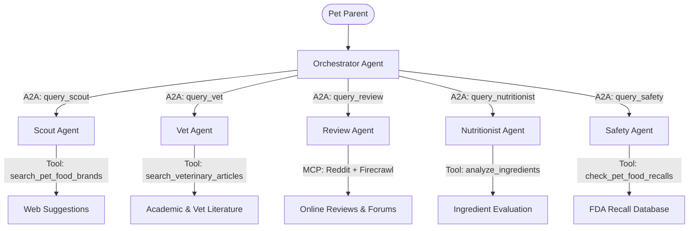

# Pet Parent Advisor Agentic System

An AI-driven multi-agent system designed to help pet parents research and select healthy pet food options. It automates searching reviews, vet articles, ingredient analysis, and safety recall checks using the **Google Antigravity SDK**.

## Multi-Agent Architecture



1. **Orchestrator (Main Hub)**: The front-facing agent that interacts with the pet parent, delegates subtasks, and synthesizes the recommendations.
2. **Scout Agent**: Discovers candidate pet food brands and product lines based on criteria (e.g., senior cats, sensitive stomach dogs).
3. **Vet Agent**: Researches clinical guidelines, veterinary articles, and academic recommendations.
4. **Review Agent**: Connects via MCP to Reddit forums and uses Firecrawl to fetch platform reviews, assessing public sentiment.
5. **Nutritionist Agent**: Inspects the candidate products' ingredients list to flag fillers, controversial additives, and evaluate macros.
6. **Safety Agent**: Monituring and checking active/historical FDA recall notices for candidate products.

---

## Setup Instructions

### 1. Install Dependencies
Ensure you have Python 3.9+ installed, then install the package requirements:
```bash
pip install -r requirements.txt
```

### 2. Configure Environment Variables
Copy the `.env.example` file to `.env`:
```bash
cp .env.example .env
```
Open `.env` and add your **Gemini API Key**:
```env
GEMINI_API_KEY=AIzaSy...
```

### 3. Setup MCP Servers (Optional)
Ensure you have **Node.js** and `npx` configured on your system PATH. The Review Agent runs these servers dynamically in the background:
- **Reddit MCP Server**: `@modelcontextprotocol/server-reddit`
- **Firecrawl MCP Server**: `firecrawl-mcp-server`

---

## Running the System

### Dry-run Simulation (Verification)
You can run a simulated run of the multi-agent pipeline offline to verify the orchestration logic and outputs without calling the live APIs:
```bash
python main.py --dry-run
```

You can customize the prompt used by the agents:
```bash
python main.py --dry-run --prompt "I have a 3-year-old cat with skin allergies. What foods do you suggest?"
```

### Live Pipeline Execution
Once you have set your API key in `.env`, run the system live:
```bash
python main.py --prompt "I need recommendations for my 7-year-old dog who has a sensitive stomach."
```

## Deployment

This project includes a Streamlit web interface (`app.py`) that can be containerized and deployed to Google Cloud Run.

To deploy the container, you can use the following `gcloud` command from the project root:

```bash
gcloud run deploy bitewise \
  --source . \
  --region us-central1 \
  --set-env-vars AGENT_MODEL=gemini-2.5-flash \
  --set-secrets GEMINI_API_KEY=GEMINI_API_KEY:latest \
  --allow-unauthenticated
```

> **Note:** The `GEMINI_API_KEY` should be securely stored in Google Cloud Secret Manager rather than passed as a plain environment variable in any real deployment.
